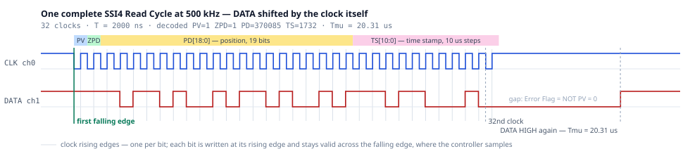
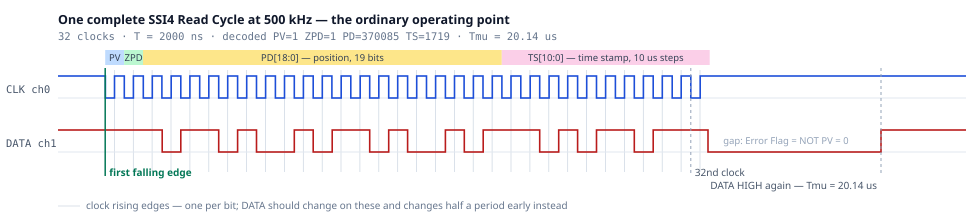
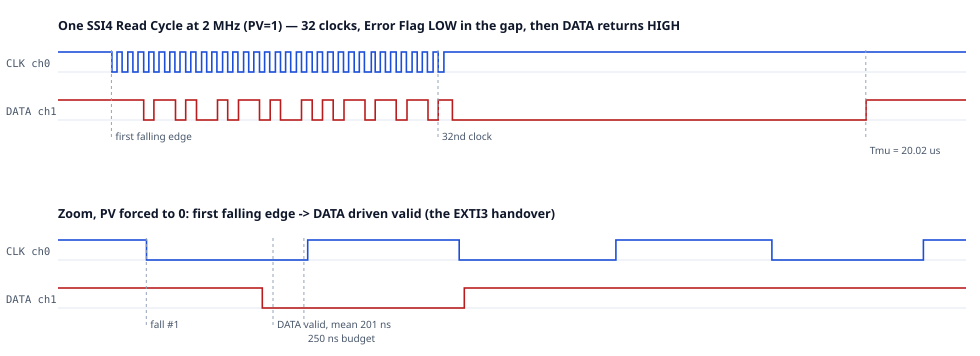

# stm32incoder — Zettlex IncOder emulator (SSI4) on NUCLEO-F446RE

Emulates a Zettlex/Celera Motion IncOder inductive angle encoder speaking the
**SSI4** protocol variant, on a NUCLEO-F446RE. The shaft angle comes from one
analog input; the SSI link is driven entirely by hardware — the incoming clock
itself shifts each bit out through DMA — so no interrupt runs per bit, and none
runs per frame on the data path at all.

Every register, pin and timing value in this project is taken from a document
in `docs/`, cited in the source. Nothing is guessed.

| Document | Used for |
|---|---|
| `docs/sensors/IncOder_Product_Guide_MIDI_ULTRA_Rev_4.11.8.pdf` | SSI protocol (5.4.1), SSI4 frame (5.4.2), update rate (4.12), zero point (5.2) |
| `docs/stm32/stm32f446mc.pdf` (DS10693 Rev 11) | pin alternate functions (Table 11), 5 V tolerance (Table 10) |
| `docs/stm32/rm0390-….pdf` (RM0390 Rev 9) | DMA request mapping (Tables 28/29), bus maximum frequencies |
| `docs/stm32/um1724-….pdf` (UM1724 Rev 17) | board connectors (Table 19/29), LD2, VCP, HSE options |

## Build and flash

```sh
git submodule update --init          # cmsis_core, cmsis_device_f4, hal_driver

cmake -B build -G Ninja -DCMAKE_TOOLCHAIN_FILE=cmake/arm-none-eabi.cmake \
      -DCMAKE_BUILD_TYPE=Release
cmake --build build
cmake --build build --target flash          # OpenOCD, board/st_nucleo_f4.cfg
```

Console/trace on the ST-LINK virtual COM port, **921600 8N1**:

```sh
stty -F /dev/ttyACM0 921600 raw -echo && cat /dev/ttyACM0
```

`SIMENC_CLOCK_SOURCE` defaults to **AUTO**: lock the 8 MHz ST-LINK MCO (HSE) if
the board's solder bridges provide it (UM1724 7.9.1, the factory setting), and
fall back to the internal 16 MHz RC otherwise. HSE is preferred because HSI
misses the Time Stamp accuracy specification — see
[Measured against the specification](#measured-against-the-specification). The
banner reports which oscillator locked. Force one with
`-DSIMENC_CLOCK_SOURCE=HSE` (hangs if absent) or `=HSI`.

### Build options

| Option | Default | Effect |
|---|---|---|
| `SIMENC_CLOCK_SOURCE` | `AUTO` | `HSE`, `HSI`, or try HSE and fall back |
| `SIMENC_RAMFUNC` | `ON` | SPI path only: run `EXTI3_IRQHandler` from SRAM; halves its jitter |
| **`SIMENC_TIMER_DATA`** | **`ON`** | **the default data path.** No SPI1: TIM8 is clocked by the SSI clock itself and DMA shifts each bit onto `GPIOB->BSRR`. **Requires the clock wired to PC6** as well as PB3 |
| `SIMENC_CLOCK_COUNTER` | `OFF` | SPI path only: end of message from TIM3 counting clock edges on ETR instead of the receive byte count. **Needs the clock on PD2** (CN7-4) |
| `SIMENC_RISING_EDGE` | `OFF` | SPI path only: slave `CPOL=0`, so DATA changes on the rising edge. Requires `SIMENC_CLOCK_COUNTER`, and disturbs the first bit period |

`SIMENC_RAMFUNC` only affects the SPI path, whose `EXTI3_IRQHandler` does not
exist in the default build.

**The default needs one extra wire**: the SSI clock must reach **PC6**
(`TIM8_CH1`, morpho **CN10-4**) as well as PB3. Without it the counter never
counts, no message ever completes, and the link is simply dead — `stat` reports
`etr=NEVER REACHED n` rather than leaving that a puzzle. Build with
`-DSIMENC_TIMER_DATA=OFF` for the SPI path, which needs no extra wire but drives
DATA on the wrong clock edge.

The data paths are compared in
[How each bit reaches the wire](#how-each-bit-reaches-the-wire).

## Pin map

All alternate functions verified in DS10693 Table 11; 5 V tolerance ("FT") in
Table 10; connector positions in UM1724 Tables 19 and 29.

| Signal | Pin | AF | Arduino | Morpho | I/O structure |
|---|---|---|---|---|---|
| SSI **CLOCK in** (slave) | PB3 | AF5 SPI1_SCK | CN9-4 (D3) | CN10-31 | FT (5 V tolerant) |
| SSI **CLOCK in**, 2nd tap | **PC6** | **AF3 TIM8_CH1** | — | **CN10-4** | FT |
| SSI **DATA out** (slave) | PB4 | GPIO out, written by DMA | CN9-6 (D5) | CN10-27 | — |
| SPI1_MOSI (unused) | PB5 | AF5 | CN9-5 (D4) | CN10-29 | leave open |
| Master CLOCK out (test) | PB10 | GPIO, or AF5 SPI2_SCK | CN9-7 (D6) | CN10-25 | FT |
| Master DATA in (test) | PB14 | read via IDR, or AF5 SPI2_MISO | — | CN10-28 | FT |
| Angle analog in | PA0 | ADC1_IN0 | CN8-1 (A0) | CN7-28 | **0–3.3 V only** |
| Trace/console | PA2/PA3 | AF7 USART2 | — | — | to ST-LINK VCP |
| Status LED (LD2) | PA5 | GPIO | CN5-6 (D13) | — | — |

**The clock is tapped twice, and both taps are required in the default build.**
The SSI clock must reach PB3 *and* PC6: PC6 clocks TIM8, which is what shifts
each data bit out. One pad carries one alternate function at a time, so this
cannot be folded onto PB3 — its AF5 is already `SPI1_SCK`. On the bench that is
a jumper from CN10-31 to CN10-4; on real hardware it is a track from the MAX490
receiver output to both pins. With `-DSIMENC_TIMER_DATA=OFF` only PB3 is needed.

PB4 is a plain GPIO output in the default build — DMA writes it through `BSRR`
— and AF5 `SPI1_MISO` only in the SPI fallback.

The test-master pins carry two alternatives: by default TIM1+DMA drives PB10 as
plain GPIO and samples PB14 through `GPIOB->IDR`, while `readspi`/`burstspi` put
both into AF5 for SPI2. Nothing about the wiring changes between the two.

PC6 is otherwise unused on this board and is 5 V tolerant, so it takes the
MAX490 receiver output directly.

SPI1 is deliberately **not** on its default PA5/PA6/PA7: PA5 carries the LD2 LED
and is `TTa` (3.3 V only), which would both load the clock line and be unsafe
against a 5 V MAX490 output.

> PB3 is JTDO/TRACESWO. Using it as SPI1_SCK costs SWO trace; SWD debugging
> (which is what the on-board ST-LINK uses) is unaffected.

## Console

USART2 → ST-LINK virtual COM port, **921600 8N1**. Commands are newline
terminated; `printf 'stat\r' > /dev/ttyACM0` works while a reader holds the port.

| Command | Effect |
|---|---|
| `help` | list the commands |
| `stat` | encoder and link state (see below) |
| `src adc\|fixed\|ramp` | select the position source |
| `fixed <counts>` | fixed position, 0…524287; also selects `fixed` |
| `ramp <step>` | counts added per 100 µs update; also selects `ramp` |
| `zero set\|reset` | set the zero point here, or restore the factory one (ZPD=1) |
| `err on\|off` | force PV=0, reporting the error condition |
| `ssi 1\|2\|4\|6\|9` | select the payload variant; **SSI4 is the default** |
| `wire` | loopback jumper continuity self-test |
| `clk <hz>` | test-master clock, any rate 100 kHz…2 MHz |
| `read [n]` | run *n* Read Cycles and decode each |
| `burst [n] [gapus]` | *n* cycles back to back, summary only — use for scope capture |
| `readspi [n]`, `burstspi [n] [gapus]` | same via the SPI baud generator, as a cross-check |

`read` also prints a diagnostic line after the burst — the three DMA `NDTR`
counters plus TIM1 and DMA2 status — which is what pinned down a clock that was
dying mid-burst. Ignore it unless something is wrong.

`stat` reports the position source, position, timestamp, PV/ZPD, the internal
update count, the raw ADC value, the zero offset, completed frames, resyncs,
dropped trace bytes, whether DATA is idle high, and the clock period the slave
measured during the last frame.

### State at power-on

| | Default |
|---|---|
| System clock | HSE if the ST-LINK MCO is strapped, else HSI — the banner says which, and flags `[timestamp OUT OF SPEC]` on the HSI fallback |
| Position source | `adc` — PA0, 0…VDDA mapped to 0…524287 counts |
| Zero point | factory, so ZPD = 1 |
| PV | 1 (`err off`) |
| SSI payload variant | **SSI4** — n = 32 bits, 19-bit position, 10 µs Time Stamp |
| SSI slave | armed, Tmu = 20 µs |
| Test-master clock | **500 kHz** (timer engine) |
| LD2 | blinks at 1 Hz; hold B1 to stream state |

The emulator is serving Read Cycles from reset — no command is needed to start
it. The console only changes what it reports and drives the loopback test
master, which is not part of the emulated device.

## SSI payload variants

The transport moves *n* bits and knows nothing of their meaning, so the payload
variants are sibling codecs in `ssi/ssi_variant.c`. `ssi <n>` switches between
them at runtime; it reconfigures the frame length, the position field width and
the Time Stamp tick, then re-arms.

| Variant | n | Layout (Product Guide 5.4.2) | Position | Time Stamp |
|---|---|---|---|---|
| SSI1 | 24 | D23 PV, D22 ZPD, D21-D0 PD | 22 bit | — |
| SSI2 | 24 | D23-D2 PD, D1 parity, D0 alarm | 22 bit | — |
| **SSI4** | 32 | D31 PV, D30 ZPD, D29-D11 PD, D10-D0 TS | 19 bit | 10 µs |
| SSI6 | 32 | D31-D24 CRC-8, D23 PV, D22 ZPD, D21-D0 PD | 22 bit | — |
| SSI9 | 32 | as SSI4 | 19 bit | 1 µs |

Verified on the wire with `fixed 0x12345`, each decoding back to 74565 and each
running `burst 100 50` at `ok=98 bad=0`:

```
ssi1  C12345      PV|ZPD|0x12345
ssi2  048D16      0x12345<<2, parity 1 (odd), alarm 0
ssi4  C91A2AA2    PV|ZPD|0x12345<<11|ts
ssi6  DFC12345    CRC-8 0xDF over the 24-bit body
ssi9  C91A2B92    as ssi4, TS counting in 1 µs steps
```

SSI7 (n=30) and SSI8 (n=18) are **not** implemented: they are not byte aligned,
and `ssi_slave` transfers whole bytes.

Checked on the analyser at 500 kHz, 100 Read Cycles each, with the payload
decoded independently in `tools/logic/variants.py` — parity and CRC recomputed
there rather than trusted from the firmware:

| Variant | clocks/cycle | Tmu | frames | integrity |
|---|---|---|---|---|
| SSI1 | 24 × 100 | 20.13 µs | pass | — |
| SSI2 | 24 × 100 | 20.34 µs | pass | parity ✓ |
| SSI4 | 32 × 100 | 20.03 µs | pass | — |
| SSI6 | 32 × 100 | 20.04 µs | pass | CRC-8 ✓ |
| SSI9 | 32 × 100 | 20.02 µs | pass | — |

The independent CRC-8 of the SSI6 body `0xC12345` is `0xDF`, which is what the
firmware emitted — so that field is now confirmed against a second
implementation of the guide's parameters, not just round-tripped.

**The SSI6 CRC is computed in software, and has to be.** The STM32F446 has a CRC
peripheral, but RM0390 4.1 describes "a *fixed* generator polynomial" and 4.2
names it: "CRC-32 (Ethernet) polynomial: 0x4C11DB7". There is no `CRC_POL` or
`POLYSIZE` register on this family — a programmable polynomial and width arrived
with F0/F3/L4/H7. SSI6 needs CRC-8 with polynomial 0x97, so the hardware unit
cannot produce it. The software version is 24 shift/xor steps inside
`stage_frame()`, which runs in the Tmu handler *after* DATA has already been
driven high, so it is off both the 250 ns handover path and the Tmu measurement.

## Loopback testing

### Stage 1 — TTL loopback on the board (3 jumper wires)

All three wires land on the ST morpho connector **CN10**, and the DATA wire is
simply between two facing pins:

| Wire | From | To |
|---|---|---|
| CLOCK | **CN10-25** (PB10, master out) | **CN10-31** (PB3, slave in) |
| CLOCK, 2nd tap | **CN10-31** (PB3) | **CN10-4** (PC6, TIM8_CH1) |
| DATA | **CN10-27** (PB4, slave out) | **CN10-28** (PB14, master in) |

The second clock tap is what the default data path shifts bits with; it is not
needed with `-DSIMENC_TIMER_DATA=OFF`.

Equivalently, the clock wire can use the Arduino header: **CN9-7 (D6) → CN9-4 (D3)**.

The DATA pair **CN10-27 / CN10-28 are directly opposite each other** across the
two rows of CN10, so a plain 2-pin jumper cap works there — no wire needed.
The CLOCK pair is easiest on the Arduino header, where both ends are
silkscreened: **D6 → D3**.

Check the wiring before anything else — the firmware can test it itself:

```
wire
```

It drives PB10 and PB4 as GPIO and verifies that PB3 and PB14 follow both
levels, printing `OK` or `OPEN` per wire. It does **not** check the PC6 tap —
`stat` does, reporting `etr=counted n` once a full message has been clocked, or
`etr=NEVER REACHED n` if that wire is missing. Do not test that tap by asking
whether the counter has seen an edge: a floating pin picks up enough noise to
answer yes while the link stays dead. `OPEN` means that pin pair is not
connected, whatever the wire looks like.

`wire` is safe to run at any time: the slave resets SPI1 through
`RCC->APB2RSTR` on every arm, so the clock edges the test injects cannot leave
the byte framing skewed. It used to, and needed a board reset afterwards — see
"Arming resets the peripheral" below.

Then:

```
src fixed
fixed 0x12345      # bypasses the ADC entirely
read 4             # runs 4 Read Cycles and decodes each frame
stat
```

`read` should report `pd=74565` (0x12345) with `pv=1`, `zpd=1`, and a `ts` that
advances between cycles. With no jumpers fitted you get `raw=FFFFFFFF` instead —
that is the master's idle pull-up, and `frames=0` in `stat` confirms it.

### Test clock rates

`clk <hz>` sets the master clock. It is generated by TIM1 compare events driving
DMA writes to `GPIOB->BSRR`, so **any rate of the form 180 MHz / N is reachable**
across the whole specified window — not just the four rates the SPI baud
generator can produce. N is bounded by the window itself: N = 90 is 2.000 MHz,
N = 1800 is 100.0 kHz. Resolution is coarsest at the top (1.1 % per step at
2 MHz, 0.06 % at 100 kHz).

Verified against the slave's own independent period measurement:

| Requested | Programmed | Slave measured T |
|---|---|---|
| 2 MHz | 2 000 000 Hz | 495 ns |
| 1 MHz | 1 000 000 Hz | 995 ns |
| 500 kHz | 500 000 Hz | 1997 ns |
| 250 kHz | 250 000 Hz | 3999 ns |
| 100 kHz | 100 000 Hz | 10000 ns |

Every rate programmed exactly (+0.0 %), and `burst 40` decoded `ok=38 bad=0` at
each — `burst` skips two warm-up cycles, so it reports `n-2`. The power-on
default is **500 kHz**.

`readspi` / `burstspi` run the same traffic through the SPI baud generator
instead. That path only reaches 1.40625 MHz, 703.125 kHz, 351.5625 kHz and
175.78125 kHz, but it samples DATA with a hardware shift register rather than a
phase-programmed DMA read, so it is a useful independent cross-check.

### Arming resets the peripheral

`ssi_arm()` resets SPI1 through `RCC->APB2RSTR` rather than merely clearing
`SPE`, because **clearing `SPE` does not empty the transmit buffer**. A byte
left there is shifted out ahead of the next frame, so every following Read Cycle
arrives one byte late — and since each re-arm just queues four more bytes behind
the stale one, the offset never clears itself.

That was reachable in practice: `wire` toggles the clock pin, the armed SPI
counted those edges, and a partial byte was stranded. At 500 kHz, `burst 200 50`
went from `ok=198 bad=0` to `ok=7 bad=191` if `wire` had run first. With the
reset it is `ok=198 bad=0` either way, and the first Read Cycle after `wire` —
which used to be reliably wrong — now decodes correctly too.

### Oversampling and the update rate

Two rates, easily conflated, and the guide fixes both:

- **Position latch: 10 kHz.** §4.12 gives "Internal Position Update Period
  < 0.1 millisecond", and §5.5.1 pins the value by describing ASI2 frames as
  "transmitted at a rate of 10kHz nominal (*same rate as Internal Position
  Update Period*)". So 100 µs is the specified rate, not a floor to beat.
- **Time Stamp tick: 10 µs**, i.e. a 100 kHz counter spanning 0.00…20.47 ms
  (§5.4.2). That 100 kHz is the *counter*, not the latch.

The emulator has always latched at 10 kHz and ticked TS at 100 kHz, which is
correct. What was wrong is what the latch averaged: four ADC samples taken *at*
the update rate, so every position was a moving average over the previous
400 µs — four update periods. TS claims to record when the position was
measured, and a 400 µs smear makes that claim false.

The ADC now free-runs and each update averages the 12 conversions taken during
that period (12 × 8.53 µs = 102 µs against the 100 µs period), which is both
genuinely per-period and worth about 1.8 bits of noise averaging.

### One-cycle data latency is intentional

A value changed between Read Cycles appears in the *next* frame, not the current
one: the payload is staged at the end of Tmu, matching "after Tmu, the latest
position data is now available for transmission in the next Read Cycle"
(5.4.1 note 4). A real encoder latches its data the same way.

Measured, changing `fixed` and reading immediately each time:

| after | Read Cycle 0 | Read Cycles 1+ |
|---|---|---|
| `fixed 0x12345` | 370085 *(previous)* | **74565** |
| `fixed 0x5A5A5` | 74565 *(previous)* | **370085** |
| `fixed 0x2AAAA` | 370085 *(previous)* | **174762** |

Exactly one cycle, and every stale frame is well formed — `pv=1`, `zpd=1`,
correct structure. `burst` skips two warm-up cycles rather than one: only one is
needed for the staging itself, the second is margin against a console command
landing mid-cycle.

### Stage 2 — RS-422 through two MAX490

A MAX490 has one driver and one receiver, which is exactly the SSI topology:
DATA is driven differentially by the encoder, CLOCK is received differentially.
Use two modules, U1 on the encoder side and U2 on the controller side.

```
DATA  (encoder -> controller)
  PB4  ──▶ U1.DI     U1.Y/Z ══twisted pair══▶ U2.A/B     U2.RO ──▶ PB14

CLOCK (controller -> encoder)
  PB10 ──▶ U2.DI     U2.Y/Z ══twisted pair══▶ U1.A/B     U1.RO ──▶ PB3
```

- **Supply:** MAX490 is a 5 V part — feed it from CN6-5 (+5V). Its RO outputs
  swing to ~5 V, which is safe because PB3 and PB14 are both `FT`. In the other
  direction the STM32's 3.3 V output clears the MAX490's ~2 V input threshold.
- **Ground:** tie the two modules' grounds together and to the Nucleo GND.
- **Termination:** the Product Guide states that DATA outputs and CLOCK inputs
  are *not* terminated with load resistors. Add 120 Ω at the receiving end only
  if you run a long pair.

**Verified on the RS-422 link**, with both pairs running through the two
modules, `fixed 0x5A5A5`, `burst 200 50` at each rate:

| Master clock | Result | Payload |
|---|---|---|
| 100 kHz | 198/198 | correct |
| 250 kHz | 198/198 | correct |
| 500 kHz | 198/198 | correct |
| 1.0 MHz | 198/198 | correct |
| 1.5 MHz | 194–197 / 200 | correct |
| 2.0 MHz | 196–198 / 200 | shifted one bit — see below |

`resyncs=0` throughout, and all five variants are clean at 500 kHz (98/98 each
for SSI1, SSI2, SSI4, SSI6, SSI9). The two top rates scatter by half to two per
cent run to run, but they scatter by the same amount over the plain TTL jumpers
measured the same afternoon, so that is the link's own margin at those rates
rather than anything the transceivers introduce. (Those figures are from the SPI
data path, which is no longer the default.)

The one-bit shift at 2 MHz — the test master decodes PD as 447186 =
`(0x5A5A5 >> 1) | 0x40000` instead of 370085, consistently, which is why the
count still reads 198/198 — is the on-board master sampling, not the wire. The
logic analyser decodes the same frames correctly at 2 MHz. It is the KNOWN
DEVIATION above seen from the receiving end: master and slave are both a half
period out, in the same direction, which cancels below ~1 MHz and stops
cancelling as the period approaches the sampling delay.

## Conformance: clock edges and the Error Flag

Everything below is measured on the analyser, not inferred.

### How each bit reaches the wire

SSI puts each data bit on the CLOCK's **rising** edge; the controller then reads
it in the phase that follows, sampling on the **falling** edge. The first
falling edge only starts the Read Cycle and latches the position — no data moves
on it.

The sources agree:

- IncOder §5.4.1 note 2: "Each rising edge of the CLOCK transmits the next data
  bit of the message, starting with Dn-1."
- POSITAL: "With the following rising edge transition of the clock signal the
  transmission begins with the most significant bit (MSB). With each following
  rising edge transition of the clock signal, the next bit is set on the output
  of the data line."
- RLS: "The MSB then appears on the DATA output at the next rising edge… At each
  subsequent rising edge of the CLOCK the next bit is transmitted."

There are three data paths in the tree. **The default is the last one**, which
is the only conformant one; the other two are kept because they need no extra
wire and because the comparison is what established what "correct" costs.

| | **default** | SPI fallback | SPI + `RISING_EDGE` |
|---|---|---|---|
| Built by | (nothing) | `-DSIMENC_TIMER_DATA=OFF` | + `RISING_EDGE`, `CLOCK_COUNTER` |
| Bits shifted by | TIM8 + DMA → `BSRR` | SPI1 slave | SPI1 slave |
| DATA changes on | rising edge, −72 ns | **falling edge** | rising edge, +8 ns |
| DATA quiet between F1 and R1 | yes, 0/198 | yes | **no — 198/198 disturbed** |
| Error Flag | **hardware, at the last falling edge** | ISR, 0.83 µs late | ISR, 0.83 µs late |
| Gap opens with a spurious pulse | **no, 0/197** | yes, ~half of cycles | yes, ~half of cycles |
| Pin handover at F1 | **none** | EXTI3, 250 ns deadline | EXTI3, 250 ns deadline |
| Frame length | any n | multiple of 8 | multiple of 8 |
| Extra wiring | clock also on PC6 | none | clock also on PD2 |

All three serve every rate from 100 kHz to 2 MHz with `resyncs=0`.

### The SPI fallback drives DATA half a period early

The SPI is configured `CPOL=1/CPHA=1`, so each bit is set on the falling edge —
half a period before the specification asks for it. A controller sampling on the
falling edge reads the stream shifted by one bit position. Measured at 500 kHz:
3760 in-message transitions, all following a falling edge by a median 8 ns, none
following a rising edge.

This is what the emulator did before the timer path existed, and it is kept as
`-DSIMENC_TIMER_DATA=OFF` because it needs no extra wire.

### `SIMENC_RISING_EDGE` fixes the edge but disturbs the first bit period

Setting the slave to `CPOL=0` (keeping `CPHA=1`) moves the output to the
specified edge:

| slave setting | DATA moves | verdict |
|---|---|---|
| `CPOL=1/CPHA=1` (shipping) | 9 ns after the **falling** edge | half a period early |
| `CPOL=0/CPHA=1` | **7 ns after the rising edge** | matches the specification |

What blocked this for a long time was frame sequencing. With `CPOL=0` the clock
count stayed right — 32 on every cycle — but only alternate frames carried the
payload: `ok=99 bad=101` over 200 cycles, alternating with an empty `C0000000`,
and identical at four different sample points, so the slave really was emitting
an empty frame every second cycle rather than it being a sampling artefact. The
cause is the SPI state machine being enabled during the gap with the clock
idling HIGH, which is not `CPOL=0`'s idle level. Asserting `SPE` only after the
first falling edge fixes the idle state, but costs the receive path one capture
edge — n-1 instead of n — and that count was exactly what detected end of
message. `SIMENC_CLOCK_COUNTER` removed that dependency and unblocked it.

Measured at 500 kHz it is correct for bits 2…32: 3944 transitions a median 8 ns
after a rising edge, against 0 for the SPI fallback. 198/198 at 500 kHz, 1 MHz
and 2 MHz, `resyncs=0`.

**But it disturbs the first bit period, on every cycle.** Nothing may touch DATA
between the first falling edge and the first rising edge; the line must hold
what it had.

| Build | DATA moves between F1 and R1 | when |
|---|---|---|
| Shipping @ 500 kHz | 0 / 198 | — |
| `SIMENC_RISING_EDGE` @ 500 kHz | **198 / 198** | 288–312 ns after F1 |
| `SIMENC_RISING_EDGE` @ 2 MHz | 0 / 198 | — |

The cause is the handover itself: PB4 is held HIGH by GPIO through the gap, and
at F1 the EXTI3 handler flips it to alternate function and enables `SPE`, after
which the SPI drives the line ~300 ns later, at a moment unrelated to R1. The
2 MHz row is the same fault in disguise, not a pass — there the half period is
250 ns, so the same ~300 ns delay lands *past* R1 and shows up instead as the
first bit arriving 88–96 ns after the rising edge.

This cannot be fixed inside the SPI approach: the pin must change owner
somewhere in that window, and wherever it does, the line moves.

### `SIMENC_TIMER_DATA` — the clock shifts the bits itself

This drops SPI1 entirely. TIM8 is clocked by `TI1F_ED`, the channel-1 edge
detector, which counts **both** clock edges; with `ARR=1` the counter wraps every
second edge, and because the clock idles HIGH the edges pair as (F1,R1),
(F2,R2)… so the wrap always lands on a rising edge. A frozen channel-2 compare
with `CCR2=0` matches at that wrap and raises one DMA request, which writes the
next bit to `GPIOB->BSRR`.

Counting both edges also gives the **Error Flag** a hardware slot. A second
compare, channel 4 with `CCR4=1`, matches when the counter is at 1 — every
falling edge — and drives a second DMA from a buffer of n+1 words: n zeros and
then the flag. Writing 0 to `BSRR` sets and resets nothing, so the first n are
deliberate no-ops and only the (n+1)'th falling edge moves the line. That edge
is the one that ends the Read Cycle, by which point the controller has sampled
D0, so it is the only instant that satisfies both note 3 and the controller.
No interrupt is involved.



Measured on the analyser at 500 kHz, 198 cycles:

| | result |
|---|---|
| Clocks per cycle | 32 on every cycle |
| **DATA moves between F1 and R1** | **0 / 198** |
| Payload sampled at the falling edge | **198 / 198 correct** |
| DATA vs nearest rising edge | −72 ns median (−80…−16) |
| Tmu | 20.30 µs mean (20.28–20.34) |
| Gap level | LOW ×200 |
| **Gaps opening with a spurious HIGH pulse** | **0 / 197** |
| Last clock → Error Flag on the line | 896 ns = exactly half a period |

The first-bit-period problem is gone structurally rather than by arrangement:
PB4 stays a GPIO output for the whole cycle, only the *writer* changes, and no
compare event exists between F1 and R1, so nothing can write there.
`EXTI3_IRQHandler` does not exist in this build at all, and with it go the 250 ns
deadline and its 26 ns margin. The multiple-of-8 frame limit goes too, which is
what kept SSI7 (n=30) and SSI8 (n=18) out.

It needs the clock on **PC6** (`TIM8_CH1`, AF3 — morpho CN10-4) as well as PB3.

**Unexplained: the −72 ns.** Each bit is written slightly *before* its rising
edge rather than just after, and tightly so (p25 = p50 = p75 = −72 ns). No clock
event sits there, and DMA latency could only make it late. It is harmless for a
controller sampling on the falling edge — the bit is valid across that edge,
which is why the payload decodes 198/198 — but 72 ns is 3.6 % of a bit period at
500 kHz and 14 % at 2 MHz. Understand it before making this the default.

Three hardware facts cost a probe cycle each and are recorded in `board.h` so
they are not retried:

- `ARR=0` does **not** give one update event per edge; it blocks the counter
  outright (RM0390 states this in four separate timer chapters). Every register
  reads back correct while nothing happens.
- The trigger event with `TDE` fires exactly **once**, because nothing clears
  TIF.
- **DMA1 cannot reach GPIO.** It is on AHB1; driving `GPIOB->BSRR` from DMA1
  raises a transfer error on the first word and the hardware disables the stream
  (measured: TEIF set, NDTR 32 → 31, EN cleared). Only DMA2 can, which is why
  the test master — TIM1 on APB2, hence DMA2 — always worked. Hence TIM8.

### What the loopback can and cannot prove here

The on-board test master samples on the **rising** edge, matching the shipping
build's own bug. So it confirms framing, clock counts and `resyncs`, but it
cannot confirm the edge. With either rising-edge build the master reads the
payload shifted by one bit — `pd=447186` for `0x5A5A5` — self-consistently, so
counts still read 198/198.

For the same reason `ssi2` and `ssi6` report loopback failures under those
builds while `ssi1`, `ssi4` and `ssi9` do not: those two are the only variants
carrying an integrity check (parity, CRC-8), and a one-bit shift breaks a
checksum where it merely relabels a plain position field. **Only `ssi4` has been
confirmed on the analyser** under `SIMENC_TIMER_DATA`.

### The Error Flag is late in the SPI builds, fixed in the timer build

Measured at 500 kHz, 198 cycles on the SPI fallback: the Error Flag appears
**0.83 µs after the last rising edge** (0.77–0.87), and in **195 of 198 cycles
the line is still holding the stale last data bit** during that window. Once
settled the level is always right — the gap is `NOT PV` in every cycle — so this
is purely a timing defect.

§5.4.1 note 3 has the data line set by the Error Flag *at* the last rising edge.
At 2 MHz, 0.83 µs hides inside a 20 µs gap and looks harmless. At 500 kHz it is
**41 % of a bit period** and plainly visible on a capture.

**It is worse than "the level settles late".** When the last data bit D0 happens
to be 1, the line is already HIGH when the message ends and stays HIGH until the
interrupt pulls it down — so the gap *opens with a HIGH pulse* while PV=1 says it
must be LOW throughout, and a controller reading the Error Flag early sees a
spurious error. D0 is the Time Stamp LSB, so this lands on about half of all
cycles.

| Build (500 kHz, PV=1) | gaps opening HIGH | pulse starts | width |
|---|---|---|---|
| SPI fallback | 96 / 197 | 8 ns after last clock | 1800 ns |
| `SIMENC_TIMER_DATA`, software flag | 100 / 197 | 896 ns | 440 ns |
| **`SIMENC_TIMER_DATA`, CC4 DMA flag** | **0 / 197** | — | — |

Measuring only the settled level hides it completely — that is exactly what "gap
level LOW ×200" reports, and it is why this went unnoticed for so long. It was
caught by eye on a capture, not by the analysis scripts, which now check for it.

**Fixed in `SIMENC_TIMER_DATA`.** The flag is written by the channel-4 DMA at
the last falling edge, described above, so it no longer waits for an interrupt:
measured at 896 ns after the last clock, which is exactly the half period at
500 kHz. It remains unfixed in the SPI builds, where the flag is driven from
software in `end_of_message()` and inherits interrupt latency.


## Measured against the specification

Captured with a Saleae Logic Pro 16 at 125 MS/s (8 ns resolution), 3.3 V
threshold, falling-edge trigger on the clock: `clk 2000000` then `burst 200 50` with `fixed 0x5A5A5`, run once with PV=1 and once with `err on`.

**These numbers were measured with HSE locked, the critical path in SRAM
(`SIMENC_RAMFUNC=ON`) and the dynamic Tmu correction in place.** Re-capture with
`tools/logic/` after touching the SSI path — an earlier revision of this table
was silently stale for exactly that reason. (This used to cite a commit hash;
history has since been rewritten twice, which made the hash dangle. The build
configuration is the durable reference.)

### The ordinary case, at 500 kHz

At 500 kHz one bit is 2 µs, so a whole Read Cycle fits on the page at a scale
where the frame layout is legible.



One cycle, all 32 clocks, with the SSI4 fields banded over the bit cells: PV,
ZPD, PD[18:0], TS[10:0]. The payload decoded straight off the capture is
`PD=370085` — the 0x5A5A5 that was set — with PV=1 and ZPD=1, and the whole run
is **200/200 correct**, 32 clocks on every cycle, `Tmu = 20.16 µs` mean
(20.10–20.21), gap LOW throughout. The Error Flag follows the last rising edge
by 0.83 µs.

The faint vertical rules mark every **clock rising edge** — the edges the
specification says each data bit should be set on. DATA transitions land
between them, on the falling edges, which is the SPI fallback's edge
deviation ("How each bit reaches the wire", above) shown
directly rather than asserted. The green rule is the first falling edge, which
starts the Read Cycle and triggers the EXTI3 handover.

### The same thing at 2 MHz

2 MHz is the top of the specified range, and on the default data path it is not
a special case — there is no handover, no deadline and nothing to tighten, so it
measures like any other rate.



| | 500 kHz | 2 MHz |
|---|---|---|
| Clocks per cycle | 32 on every one | 32 on every one |
| Clock rate | 0.5001 MHz | 2.0007 MHz |
| Payload | 197/197 | 197/197 |
| DATA moves between F1 and R1 | 0 | 0 |
| Gaps opening with a HIGH pulse | 0 | 0 |
| Tmu (spec 20 µs ± 1) | 20.30 µs | 19.56 µs |

Both land inside the Tmu window from the same dynamic correction, which is the
point of measuring `T` per frame rather than assuming it: the half-period term
it removes is 1 µs at 500 kHz and 0.25 µs at 2 MHz.


## Critical path in SRAM (SPI path only)

> The default data path has no `EXTI3_IRQHandler` and no per-frame deadline, so
> none of this applies to it. It is kept for `-DSIMENC_TIMER_DATA=OFF`, and
> because the measurement is a useful record of what SRAM execution buys on a
> Cortex-M4.


There is **no TCM on this part** — tightly-coupled memory is a Cortex-M7 feature
and the STM32F446 is a Cortex-M4. The equivalent is to execute from SRAM, which
`SIMENC_RAMFUNC` (default **ON**) does for `EXTI3_IRQHandler`. No linker or
startup work is needed: the linker script already gathers `.RamFunc` inside the
`.data` output section, so the startup file's `_sdata.._edata` copy relocates it
at reset.

Measured on the handover at 2.000 MHz, `err on`, 1000 Read Cycles each:

| `EXTI3_IRQHandler` in | min | mean | max | jitter | worst-case margin |
|---|---|---|---|---|---|
| Flash (`-DSIMENC_RAMFUNC=OFF`) | 184 ns | 205 ns | 232 ns | 48 ns | 18 ns (7.2 %) |
| **SRAM (default)** | 200 ns | 209 ns | **224 ns** | **24 ns** | **26 ns (10.4 %)** |

SRAM is *not* uniformly faster — its mean is 4 ns worse and its best case 16 ns
worse. What it does is halve the jitter and cut the tail, which is what a hard
deadline actually cares about: worst case improves 232 → 224 ns, lifting the
margin from 7.2 % to 10.4 %. That fits the ART accelerator's behaviour — flash
is quick when its instruction cache hits and occasionally slow when it does not,
while SRAM is uniform.

Re-measured against the current tree, which has since gained `ssi_arm()`'s
peripheral reset, the `NDTR`-based period measurement and a free-running ADC:
**200–224 ns, 207 ns mean** over 199 cycles. Worst case is unchanged at 224 ns,
so none of those three costs the handover anything — which matters most for the
ADC, since that one adds bus traffic and the handover was measured to be
bus-contention sensitive rather than flash-fetch sensitive.

Two caveats worth keeping in mind. The 8 ns worst-case gain is exactly one
sample period at 125 MS/s, so the robust result here is the halved jitter, not
the 8 ns; both figures reproduced identically across 200- and 1000-cycle runs.
And 26 ns is still not a comfortable margin — this is an incremental
improvement, not a fix that makes 2 MHz safe by a wide margin.

Build the comparison yourself with `-DSIMENC_RAMFUNC=OFF`.

**Only `EXTI3_IRQHandler` belongs in SRAM.** Moving the rest of the SSI path
there too — the end-of-frame DMA handler, the Tmu timer handler, `stage_frame`
and `ssi_arm` — was measured and is *worse*:

| | Error Flag latency | Tmu | RAM |
|---|---|---|---|
| EXTI3 only (shipping) | **0.64 µs** mean, 0.71 max | 19.89 µs | 6472 B |
| Whole path in SRAM | 0.71 µs mean, 0.75 max | 20.03 µs | 7040 B |

(Both rows predate `ssi_arm()`'s peripheral reset, the `NDTR`-based period
measurement and the free-running ADC, so their absolute Tmu reads 19.89 µs
against today's 20.07 µs. They were taken under identical conditions as each
other, so the comparison between them still stands.)

That is the same effect seen above, pointing the other way: SRAM trades mean
speed for determinism. The handover needs the tail bounded because it has a hard
250 ns deadline, so it wins there. The end-of-frame path has no hard deadline —
its latency is compensated, and its jitter is ~±0.1 µs against a ±1 µs Tmu
window — so the mean is what matters and flash is quicker. It would also cost
568 bytes of RAM and force `GAP_ISR_OVERHEAD_NS` to be re-tuned.

The test master needs nothing: its clock comes from TIM1 compare events driving
DMA, with software out of the loop entirely.

## Architecture

Layered so the SSI transport can be reused for the other SSI payload variants:

```
encoder/incoder.c        sensor behaviour: position, zero point, timestamp, PV/ZPD
        ↑
ssi/ssi_variant.c        SSI payload codecs — pure logic, no hardware
        ↑
ssi/ssi_slave.c          generic SSI slave transport (SPI1 + DMA + Tmu gap)
```

"Generic" here means **payload-agnostic, not hardware-agnostic**: `ssi_slave`
moves *n* bits and knows nothing of their meaning, so SSI1/2/6/9 (all
byte-aligned) live as further codecs in `ssi_variant.c`. It is still
specifically the SPI1-based transport — porting to another peripheral means
editing it, not swapping a back end.

`ssi/ssi_master.c` is a bring-up instrument, not part of the emulated device.

### How a Read Cycle is served

1. Between messages PB4 is a plain GPIO holding the SSI idle-HIGH level.
2. On arming, SPI1 is enabled (slave, CPOL=1/CPHA=1 — the hardware then changes
   DATA on the falling edge and the master samples on the rising edge, exactly
   the SSI relationship) and TX DMA is loaded with the 4 payload bytes. **PB4
   stays GPIO**, because the SPI drives MISO LOW while it holds the pin with no
   clock running, which would break the idle-HIGH requirement.
3. `EXTI3` fires on the master's **first falling edge** and hands PB4 to SPI1.
   This is the hard deadline: it must complete within half a clock period.
4. The **receive** DMA is what counts clocks: its half-transfer event times the
   clock period, and its transfer-complete event fires precisely when 32 clocks
   have been seen, marking end of message.
5. That ISR takes PB4 back, drives the Error Flag level, and starts TIM6 as a
   one-shot for Tmu less the measured half period and the fixed ISR overhead.
6. TIM6's update returns DATA to HIGH, stages the next frame and re-arms.

Position and timestamp are latched **together** by the 100 µs update tick, so
`TS` reports when the position was measured rather than when it was sent.

### Peripheral allocation

| Peripheral | Role | DMA (RM0390 Tables 28/29) |
|---|---|---|
| SPI1 slave | SSI DATA shift-out, clock counting | TX DMA2 S3 C3, RX DMA2 S2 C3 |
| EXTI3 | first-falling-edge handover of the DATA pin | — |
| TIM3 | `SIMENC_CLOCK_COUNTER` only: counts clock edges on ETR (PD2) | — |
| **TIM8** | **`SIMENC_TIMER_DATA` only: clocked by TI1F_ED on PC6; CH2 compare shifts DATA. Replaces SPI1 and EXTI3** | **CH2→DMA2 S3 C7 → `GPIOB->BSRR`** |
| TIM6 | Tmu one-shot gap, 0.1 µs tick | — |
| TIM7 | Time Stamp counter, 10 µs tick, wraps 2048 | — |
| TIM2 | 10 kHz update tick + ADC trigger (TRGO) | — |
| ADC1 IN0 | angle acquisition | DMA2 S0 C0, circular |
| USART2 | trace/console | TX DMA1 S6 C4 |
| **TIM1** | **test-master clock, any 180 MHz / N** | **CH1→DMA2 S1 C6 (clock low), CH3→S6 C6 (clock high), CH4→S4 C6 (sample IDR)** |
| SPI2 master | `readspi`/`burstspi` cross-check only, polled | — |

`SIMENC_TIMER_DATA` frees SPI1's two DMA streams by not using SPI1 at all, so
its own stream reuses DMA2 S3. It must be DMA2: GPIO is on AHB1 and DMA1 cannot
reach it.

The two masters are alternatives, not layers: TIM1 drives the clock pin as plain
GPIO via DMA writes to `BSRR`, while SPI2 drives it as AF5. Only one owns PB10
at a time, and the timer engine restores the pin afterwards.

## Design decisions that are *not* from the specification

- **The analog input is 3.3 V only — there is no 5 V-capable ADC pin, and no
  way to make one.** DS10693 gives the ADC conversion range as `VAIN` =
  0…**VREF+**. The `FT` marking describes the *digital* I/O structure; in analog
  mode the pad switches straight onto the ADC sampling capacitor, so PA0 being
  `FT` does **not** make it a 5 V analog input.

  Neither supply trick helps. On the LQFP64 the datasheet pinout labels pin 13
  **`VDDA/VREF+`** and pin 12 **`VSSA/VREF-`** — VREF+ is internally bonded to
  VDDA, so raising VREF+ *is* raising VDDA. And DS10693 Table 13 gives the
  absolute maximum for "External main supply voltage (including VDDA, VDD,
  VDDUSB and VBAT)" as **4.0 V**, with an operating range of 1.7–3.6 V. Feeding
  5 V to VDDA/VREF+ — with or without SB57 removed — exceeds the absolute
  maximum and would damage the part, and VDDA also feeds the RCs and PLL, not
  just the ADC. Removing SB57 is only useful for supplying a *cleaner* reference
  from CN5 pin 8 within 1.7–3.6 V (keeping VDDA − VREF+ < 1.2 V).

  Scale a 5 V source with a divider instead, keeping the source impedance under
  the 50 kΩ `RAIN` limit: 5.1 kΩ / 10 kΩ gives 5 V → 3.31 V at ~3.4 kΩ.
- **Analog → angle mapping.** 0 V…VDDA maps linearly onto 0…524287 counts
  (0…360°). The ADC is 12-bit, so an analog-driven position moves in steps of
  128 counts even though the SSI4 field is 19-bit.
- **19-bit resolution.** SSI4 caps measurement resolution at 19 bits, so the
  emulator presents the maximum the variant allows.
- **Update rate 10 kHz.** The guide specifies "< 0.1 ms"; 100 µs is the fastest
  value satisfying it.
- **Error-flag hold time.** The guide holds the Error Flag for `Tmu − 0.5·T`.
  The emulator does measure `T` — from the receive DMA's half-transfer to
  transfer-complete interval — and sets the gap to `Tmu − 0.5·T` less a fixed
  interrupt overhead, so Tmu lands inside spec across the whole clock range
  (verified 20.07 µs at 2 MHz and 20.14 µs at 100 kHz). The residual deviation
  is at the *start* of the gap, not its length: the Error Flag appears ~0.7 µs
  late because the end-of-frame interrupt has to run first.

## Known limitations

- **The default needs the SSI clock on PC6** (CN10-4) as well as PB3. Without
  it nothing works; build with `-DSIMENC_TIMER_DATA=OFF` if you cannot fit that
  wire, at the cost of DATA landing on the wrong clock edge.
- **The Error Flag is late in the SPI builds** — 0.83 µs after the last rising
  edge, and because it is late the gap opens with a spurious HIGH pulse on
  about half of all cycles. Fixed in the default build, where hardware drives it
  at the last falling edge.
- **The −72 ns is unexplained.** Each bit is written slightly before its rising
  edge rather than just after. Harmless for a controller sampling on the falling
  edge, but not understood.
- `ssi_slave` supports byte-aligned frame lengths only (n = 8/16/24/32) *in the
  default build*, so SSI1, SSI2, SSI4, SSI6 and SSI9 are implemented and SSI7
  (n=30) and SSI8 (n=18) are not. `SIMENC_CLOCK_COUNTER` and
  `SIMENC_TIMER_DATA` both remove that restriction — end of message no longer
  comes from a byte count — but neither variant has been written yet.
- The SSI6 CRC is checked against our own implementation of the guide's
  parameters, which proves round-trip consistency rather than conformance to an
  external reference vector.
- Single-turn only; the multi-turn variants (SSI31/32) are not implemented.
- **SPI path only** — the EXTI3 handover has a hard deadline (the default
  build has no handover at all): it must set DATA to the SPI output
  within half a clock period of the first falling edge — 250 ns at the 2 MHz
  maximum, 1 µs at the 500 kHz power-on default. It is the highest-priority
  interrupt in the system for that reason, and is verified at 2.000 MHz with PV
  forced to 0 (`clk 2000000` then `err on`). If D31 is ever seen wrong, this is
  where to look — drop the clock rate to confirm.
- **SPI path only** — the handover margin is ~10 % and that is close to
  inherent. See
  "Critical path in SRAM" above for the measurement. Roughly 200 ns of the
  budget is interrupt entry and EXTI propagation rather than the handler body,
  which is three register writes, so further code tuning has little headroom.
